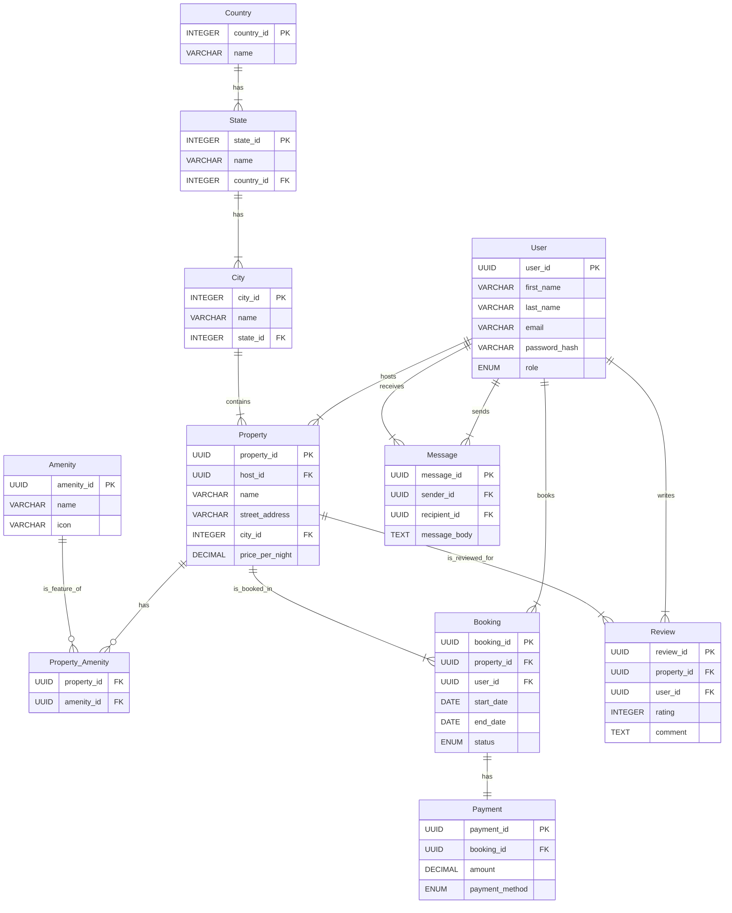

# Airbnb Clone - Backend Database Schema

This repository contains the complete database schema and backend foundation for a full-featured Airbnb clone application. The schema is designed to be robust, scalable, and is normalized to the Third Normal Form (3NF) to ensure data integrity and reduce redundancy.

## 🌟 Features Supported by this Schema

The database design supports all core functionalities expected from a modern property rental platform:

*   👤 **User Management:** Secure user registration and authentication with distinct roles (`guest`, `host`, `admin`).
*   🏨 **Property Listings:** Comprehensive property management, including detailed descriptions, pricing, and location data.
*   🗺️ **Structured Location Data:** Normalized location tables (`Country`, `State`, `City`) for efficient searching and filtering.
*   ✨ **Amenities Management:** A flexible many-to-many system for assigning various amenities (WiFi, Pool, etc.) to properties.
*   📅 **Booking System:** Core logic for users to book properties for specific date ranges, with status tracking (`pending`, `confirmed`, `canceled`).
*   💳 **Payment Processing:** A dedicated table to track payment information for each booking.
*   ⭐ **Reviews and Ratings:** A system for guests to leave ratings and comments on properties they've stayed at.
*   💬 **User-to-User Messaging:** A direct messaging feature to facilitate communication between guests and hosts.

## 💾 Database Schema

The schema is designed for a PostgreSQL database, leveraging features like `UUID` for non-sequential primary keys and `ENUM` for data consistency.

### ER Diagram

The following diagram illustrates the relationships between the different entities in the database.

Click to view the Entity-Relationship Diagram

### Table Descriptions

*   **User**: Stores user account information, including credentials and roles.
*   **Country, State, City**: Normalized tables for geographic data, ensuring consistency.
*   **Property**: The central table for property listings, linked to a host and a location.
*   **Amenity**: A master list of all possible amenities.
*   **Property\_Amenity**: A junction table resolving the many-to-many relationship between properties and amenities.
*   **Booking**: Contains records of all booking requests, linking users to properties.
*   **Payment**: Stores details of the financial transaction for each booking.
*   **Review**: Holds user-submitted reviews and ratings for properties.
*   **Message**: Stores messages sent between users.
